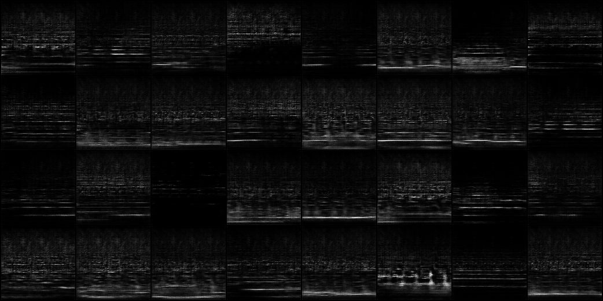

# DCGAN128
This is an implementation of [Deep Convolutional Generative Adversarial Networks](https://arxiv.org/abs/1511.06434)
modified to create 128*128 sized spectrograms to be able to be converted to WAV files using [Analysis & Resynthesis Sound Spectrograph](https://arss.sourceforge.net/) or ARSS for short. 

# Prerequisites
- install ffmpeg
- install arss
```
pip install tqdm
```
# Usage
Put wav files (songs of the same genre) in a folder and run
```
python process.py
```
Follow the prompts after running, process.py will split the wav files into 2 second segments and convert them into spectrograms of file type bmp using ARSS. Then since the bmp files are greyscale the files will be converted to png with just 1 image channel in a folder called png.
```
python train.py
```
will prompt the name of the images data (in this case png) and appropriate batch and epoch size.

After saving the model to a pth file generate.py and subsequently bmp_to_wav.py will generate new spectrograms and wav files
```
128DCGAN-Spectogram/
    └── data
    └── bmp
    └── png
    └── bmp_generated
    └── wav_generated
    └── bmp_to_wav.py
    └── data.py
    └── generate.py
    └── model.py
    └── process.py
    └── train.py
```
# Generated Spectrograms using Songs from Tevvez (Popular EDM Artist)

